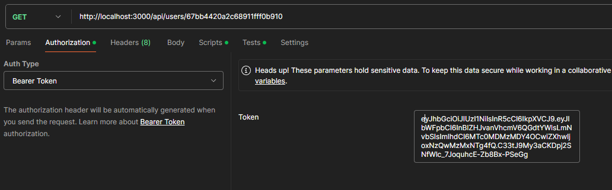

# API-Restful test

Este proyecto es un API-Restful desarrollado con NodeJs y Express utilizando MongoDB como base datos. EL objetivo es presentar funcionalidades a travez de endpoints de registro e inicio de sesion mediante JWT y hasheo simple de la contraseña, un CRUD para Usuarios y Tareas asignadas a estos y mantener los datos en una base de datos con estructura NoSQL.

## Tabla de contenidos
- [Instalación](#instalación)
- [Configuración](#Configuración)
- [Uso](#Uso)
- [Dependencias](#Dependencias)

### Instalación

Sigue estos pasos para instalar y configurar el proyecto en tu máquina local.

```bash
# Clonar el repositorio
git clone https://github.com/Hector-MuMo/labopat-test.git

# Navegar al directorio del proyecto
cd labopat-test

# Instalar dependencias
npm install
```

### Configuración

El proyecto utiliza un archivo .env para manejar las variables de entorno. Crea un archivo .env en la raíz del proyecto y agrega las siguientes variables:

```
PORT=3000
ACCESS_TOKEN_SECRET=bb4b2764a5ed72b25fb3e932d993f23da7a07bfb70195ed47eaab874eab771d2d464f213c929b4119147224434e765af4b8fb230de3f1cd0d3c8a1116cdea0e5
MONGODB_PASSWORD=admin
```

### Uso

Para iniciar el servidor en modo prueba, ejecuta el siguiente comando:
```bash
npm run dev
```

El modo local la url que se debe utililizar es *http://localhost:3000*. Y los Endpoints funcionales son lo siguientes (se recomienda usar **Postman** o alguna herramienta similar):

```js
//Autenticación

POST /api/auth/register → Registra un nuevo usuario.
// Para registrarse la estructura de los datos debe ser en formato Json. Por ejemplo:
{
  "name": "Jon",
  "lasname": "Smith",
  "email": "jonsmith@gmail.com",
  "password": "123456"
}

POST /api/auth/login → Inicia sesión y devuelve un token.
//Para iniciar sesión debe utilizar el email y la contraseña con la cual se registró. 
// Por ejemplo:
{
  "email": "jonsmith@gmail.com",
  "password": "123456"
}

```

La respuesta al iniciar sesión le arrojará un **token de acceso** para poder hacer uso de las funcionalidades CRUD en el apartado de Usuarios y Tareas. 

Para poder obtener, actualizar y eliminar usuarios se debe usar  ingresar el token de acceso generado al iniciar sesion en el apartado de  **autorización en Postman** o una herramieta similar, eligiendo el tipo de autenticación **Bearer Token** como se muestra en la imagen.



```js
//Usuarios

GET /api/users/:id → Obtener usuario por ID.
// Para obtener un usuario por ID, se debe pasar el ID del usuario en la URL. 
// Por ejemplo http://localhost:3000/api/users/1

PUT /api/users/:id → Actualizar usuario.
// Para actualizar un usuario (por ahora solo se pueden modificar el nombre y apellido), 
// se debe pasar el ID del usuario en la URL y los datos a enviar deben ser en formato Json. 
// Por ejemplo:
{
  "name": "Pedro",
  "lastname": "Perez"
}

DELETE /api/users/:id → Eliminar usuario.
// Para eliminar un usuario, se debe pasar el ID del usuario en la URL.
```

De igual manera, para poder obtener, crear, actualizar y eliminar tareas debe **ingresar el token de acceso** generado al iniciar sesión.

```js

//Tareas
POST /api/tasks → Crear tarea.
// Para crear una tarea se debe enviar una petición en formato Json como la siguiente:
{
  "userId": "67bba64f416a32ad4163603b",
  "title": "Primera tarea ",
  "description": "Esta es la primera tarea asignada al usuario"
}


GET /api/tasks → Listar tareas del usuario autenticado.
// Para obtener todas las tareas de un usuario debe enviar una petición 
// en formato Json con el ID del usario. Por ejemplo
{
  "userId": "67bba64f416a32ad4163603b"
}

PUT /api/tasks/:id → Actualizar tarea.
// Para actualizar una tarea se debe enviar el ID de la tarea en la URL y una peticion en formato Json como la siguiente: 
{
  "userId": "67bba64f416a32ad4163603b",
  "title": "Tarea actualizada",
  "description": "Esta tarea fue actualizada desde postman",
  "isComplete": true
}

DELETE /api/tasks/:id → Eliminar tarea.
// Para eliminar una tarea se debe enviar el ID de la tarea y una petición en formato Json como la siguiente:
{
  "userId": "67bba64f416a32ad4163603b" 
}
```

### Dependencias

- *bcrypt*
- *crypto*
- *dotenv*
- *express*
- *jsonwebtoken*
- *mongoose*

